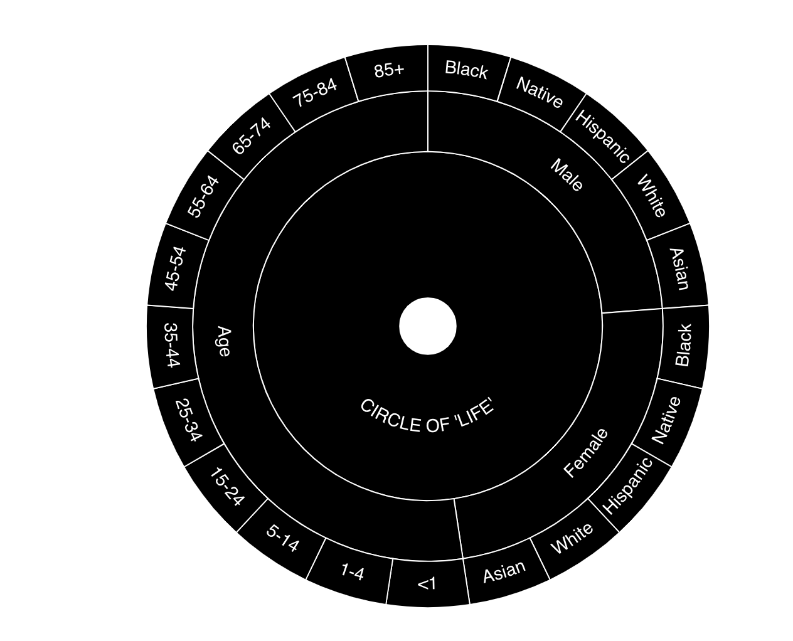
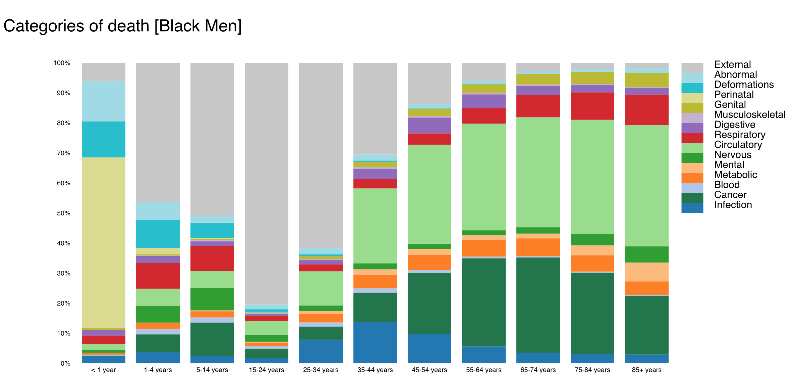

# DeathWheel

Backround
---------
 The data in this visualization is from the Underlying Cause of Death database maintained by the Centers for Disease Control and Prevention. It provides data for the number of people who died in the United States between 1996 and 2016. The values themselves are estimates for the number of people who die due to each of the causes. The values are based on U.S death certificates. The dataset I created from this database contains 15 main causes of death, and for each cause the number of people that died from it broken down race, age and gender.

The main question that this visualization is addressing is: What are the major causes of death in the United States, and how does  it vary across sex, race, and age? 
 
 Data Souce
 ---------
 https://wonder.cdc.gov/ucd-icd10.html
 
 Site
 -----
<a href="https://mvhdi.github.io/death.html"> https://mvhdi.github.io/death.html </a>

How to run
-----
1. clone this repository, and `cd DeathWheel-master`
2.  `python3 -m http.server`
3. go to http://localhost:8000/ in your browser
4. click on death.html

Pictures
--------

Interactions & reason behind stylistic choices
------------
The first part of the visualization is a sunburst chart that is used for navigation purpose to choose what part of the data a viewer wants to visualizations. I choose this over a dropdown menue as it's a more fun interaction. The center circle contains the categories (age, and race), and the outer circles show subcategories. Clicking on a section or a subsection creates a  stacked bar chart visualization for that subset of data. If you click on a category, the other categories disappear, and only subcategories are shown, and clicking on the center allows you to back out. This interaction allows the user to select what comparison they want to see in the data. For example if you select a race/gender subcategory, you view  causes of death at different ages for that selection, and if you select a age subcategory, you view causes of death for different race/gender for that selection. By creating different  selections, a view can answer different questions, like how does causes of death vary by age within a gender, an age group, a race, or any combination of these three categories. I kept the color for different categories black, as different colors for different categories didn’t add much to this, and the black and white goes with the death theme of the data. 

Once a selection is chosen, a normalized stacked bar chart is created for the data. This kind of chart is great for comparing multiple causes of death within a single bar, and seeing how they change across different bars. The data itself was death estimates, with the value being larger for demographics with larger populations in the United States, so converting the data into percentages was the best way to get a meaningful comparisons. The downside to using stacked bar charts is that it is easy to compare values visually for the value on the bottom of the stack using the y axis, but it is hard to compare values higher on the stack across bars. So in this visualization has an interaction that solves this problem by allowing the user to click on a category on a bar or its legend, and that category goes to the bottom of the stack on all the bars. Another interaction is hovering over a category in a bar shows it value and category at the top of the chart, I thought this was better than the mini box created by the hovering tooltip, especially for longer descriptions that come when you hover over the legend, and you get the CDC’s definition of a category of death. I also use different colors for different causes of death. The colors are all different and don’t have any semantic meanings. They are there to allow the user to visually see trends across the different bars, by helping them follow a cause of death across different bars. I tried to choose a different color for each one, but there are 15 causes, so I used about two shades of each color. The vertical size of a bar is proportional to its percentage, so the larger the bar the more people that cause of death kills.

